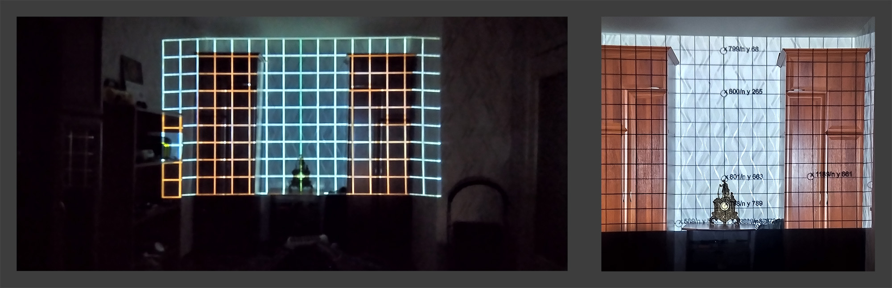

# Админка

Сетка для отрисовки объектов ground для matter.js для дальнейшего отображения в основном проекте.

Сервер на bun, используется для чтения и сохранения json файлов. 

To install dependencies:

```bash
bun install
```

To run:

```bash
bun run index.tsx
```
To open:
http://localhost:3000/index.html

## [Демо](https://ilushinvanya.github.io/projection-in-the-room-on-matter.js/admin/)


